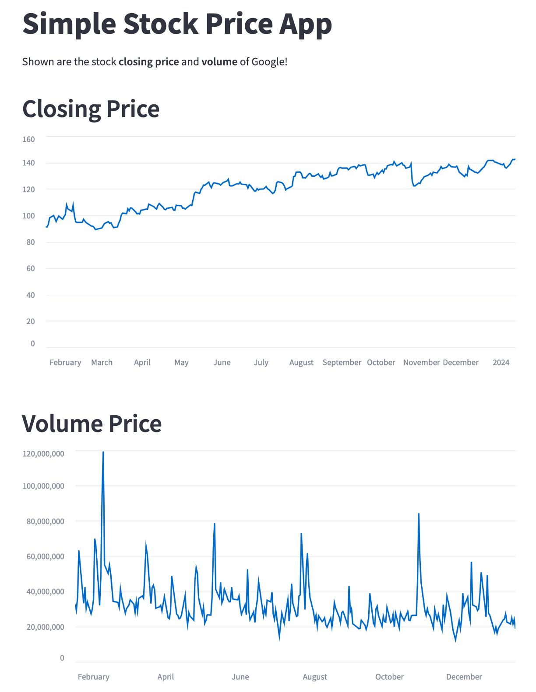

# streamlit-googl-stock

This app is using python and streamlit library to track Google stock prices.

## Installing libraries
All the packages are in the  "requirements.txt" file. You can install them in a virtual environment 

## Starting the project
To start the project, type the command [streamlit run app.py]

## App pictures
